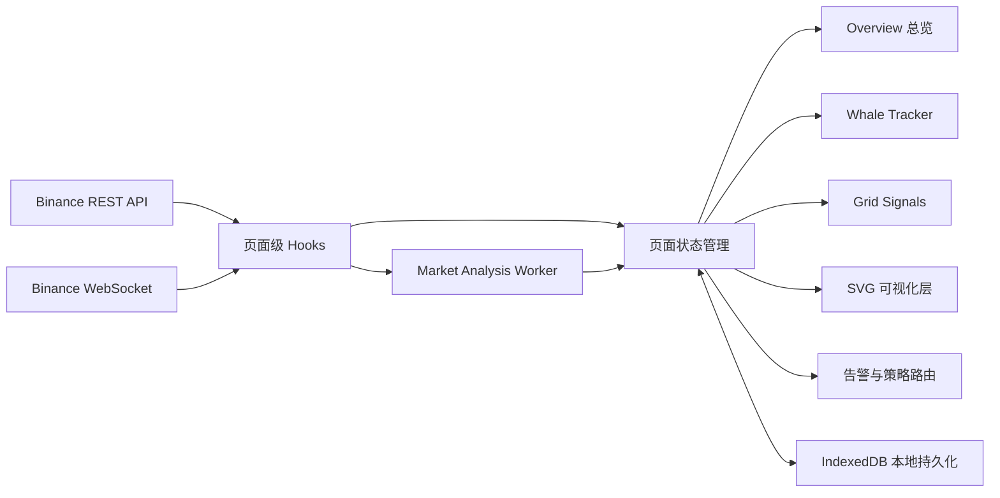
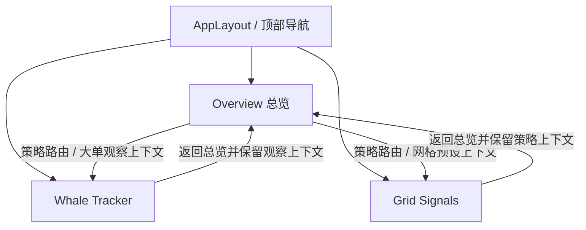
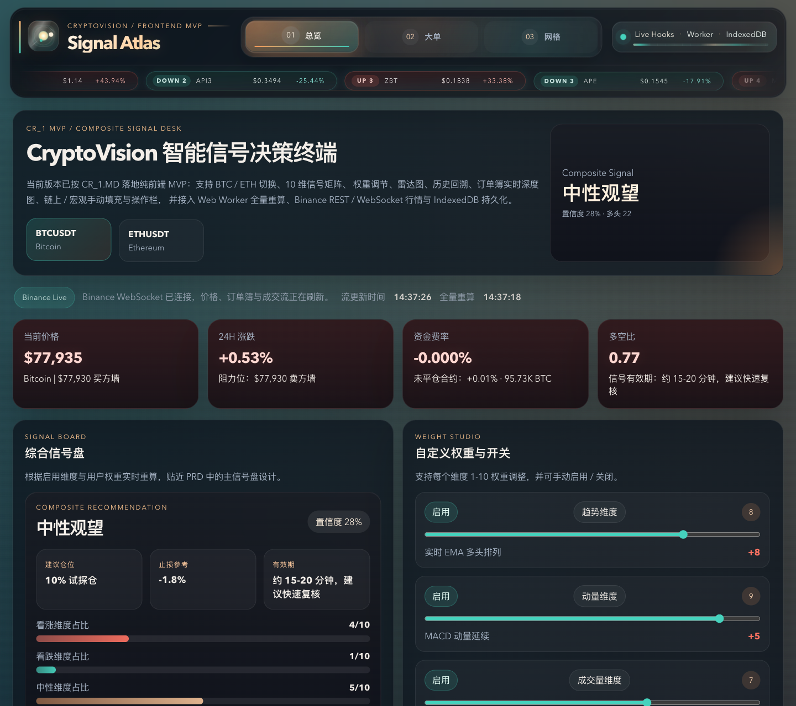
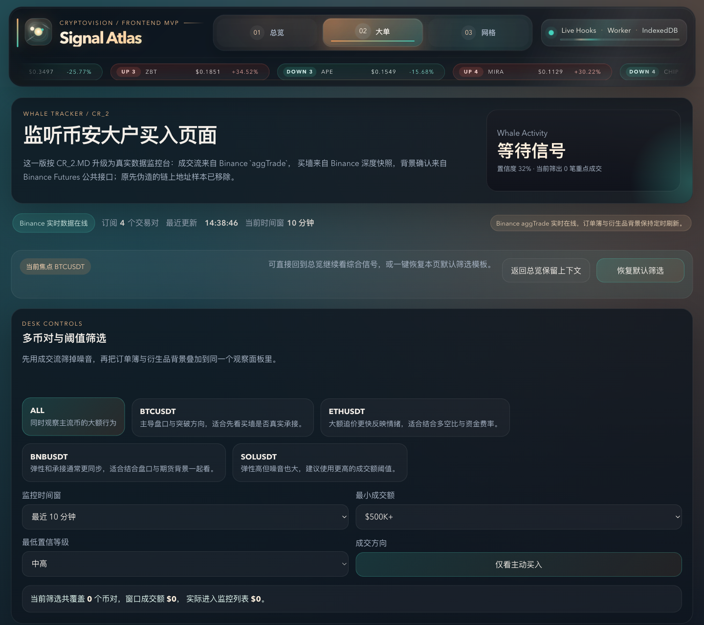
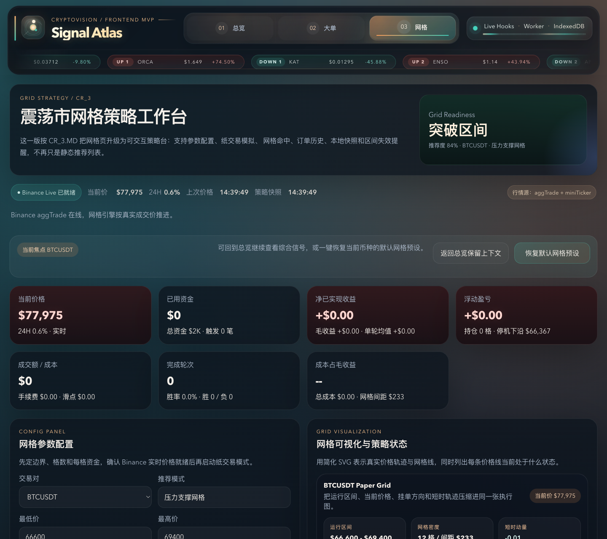

# Signal Atlas

Signal Atlas 是一个面向加密行情研判与策略执行演练的前端工作台。它把「综合信号总览」「大额成交监控」「震荡市网格策略」整合到同一套界面中，尽量把价格、盘口、资金流、策略建议与本地观察记录放在连续的决策链路里。

当前版本使用 React + TypeScript + Vite 构建，以 Binance 公共 REST / WebSocket 行情作为实时输入，通过 Web Worker 做分析重算，并用 IndexedDB 持久化快照、告警与策略配置。

## 在线体验

- 线上地址：`https://signal-atlas-nemo-fks8uuk33-nemos-projects-42ff2604.vercel.app/`
- 推荐打开后依次体验：
  - 总览页：看综合信号、实时画布和策略路由
  - Whale Tracker：看大额成交、买墙吸收与观察日志
  - Grid Signals：看网格区间、纸交易执行与风控提示

## 为什么这个项目值得看

- 把研究型看盘界面做成了一套连续工作流，而不是单个静态看板
- 支持实时价格、订单簿深度、大额成交、策略配置与本地记录同屏协作
- 核心图表不是依赖重型图表库，而是用 SVG 按业务需要定制
- Realtime Canvas 已支持 `5m / 10m / 15m` 多周期切换、布林轨、趋势状态、MACD 与盘口深度共图展示
- 既能作为前端作品展示，也能作为 Crypto 信号工作台原型继续扩展

## 快速导航

| 入口 | 说明 |
| --- | --- |
| 在线访问 | `https://signal-atlas-nemo-fks8uuk33-nemos-projects-42ff2604.vercel.app/` |
| 本地开发 | `npm install` → `npm run dev` |
| 生产构建 | `npm run build` |

## 功能总览

| 模块 | 路由 | 主要能力 | 适用场景 |
| --- | --- | --- | --- |
| 综合信号总览 | `/` | 多维度信号评分、实时价格画布、盘口深度、雷达图、提醒与历史回溯 | 快速判断当前市场状态 |
| Whale Tracker | `/whale-tracker` | 大额成交监控、订单簿买墙观察、聚合告警、观察历史 | 追踪大单驱动与短时异动 |
| Grid Signals | `/grid-signals` | 网格参数配置、实时区间可视化、纸交易执行记录、风控提示 | 演练震荡市网格部署 |

## 系统功能架构图



这个项目的核心链路是“实时行情输入 → 前端计算重组 → 页面决策呈现 → 本地快照与观察沉淀”。它更接近一个研究工作台，而不是单纯的行情展示页。

## 页面关系图



这个关系图对应 README 里的三条主路径：先在总览页形成方向判断，再按需要钻取到大单监控页或网格策略页，最后把上下文带回总览继续决策。

## 页面截图与模块介绍

> 以下截图来自本地运行环境，线上访问时行情数值会随 Binance 实时数据变化。

### 1. 综合信号总览



总览页是整个系统的主入口，重点解决“现在该看多、看空还是继续等待”的问题。

- 综合信号盘：把趋势、动量、量能、订单簿、多空比等维度收敛成统一结论
- 自定义权重与开关：允许手动调整各维度权重，快速验证不同判断框架
- Realtime Canvas：用自定义 SVG 同时承接价格走势、盘口深度与关键位观察
- 多周期切换：支持 `5m / 10m / 15m` 切换
- 指标叠加：支持布林轨、趋势状态、MACD 子图与支撑阻力标识
- 决策辅助：包含雷达图、维度拆解、提醒配置、手动上下文、历史信号回放与底部策略路由

### 2. Whale Tracker 大额成交监控



Whale Tracker 聚焦“大单是不是在推动当前行情”，把成交流、订单簿和背景确认放进同一个观察面板。

- 多币对与阈值筛选：按交易对、时间窗、成交额、置信度快速过滤
- 大额成交监控流：基于 Binance `aggTrade` 观察重点成交样本
- 聚合告警与解读：从重复成交、主动买入占比、买墙位置等维度生成结论
- 流动性观察：查看买墙吸收、挂单撤单风险与潜在诱骗结构
- 背景确认：结合 Futures 公共背景数据辅助判断是否有真实资金支持
- 观察日志：把重点样本、结论与上下文写入本地观察历史，方便复盘

### 3. Grid Signals 网格策略工作台



Grid Signals 面向震荡行情下的网格策略演练，目标是把“参数配置、区间判断、执行结果”串成一条可验证链路。

- 网格参数配置：支持交易对、区间边界、网格数、单格投入、手续费与滑点设置
- 区间可视化：把当前价格、网格层级、运行区间、失效区放进同一界面
- 候选交易对推荐：给出不同币对的参考参数与区间特征
- 执行记录：记录纸交易触发、成交价格、净收益、成本与轮次结果
- 本地快照：保存当前网格配置与运行状态，刷新后可继续查看
- 风控提示：包含突破停机、区间失效、成本侵蚀等策略守则

## 适合展示的亮点

### 1. 实时数据接入

- Binance 公共 REST：初始化价格、K 线、24H 数据与基础快照
- Binance WebSocket：持续推送 miniTicker、aggTrade、订单簿等增量流
- 页面级 hooks：把行情接入与状态提示封装到独立 hook 中，便于扩展与维护

### 2. 前端分析计算

- 使用 Web Worker 做全量重算，减少主线程卡顿
- 使用本地分析函数构建趋势、动量、量能、订单簿与共振结果
- 自定义 SVG 图表承载价格、布林轨、MACD、深度图与网格区间展示

### 3. 本地持久化

- 使用 IndexedDB 保存：
  - 总览快照
  - 告警规则与告警事件
  - 手动上下文输入
  - 大单观察记录
  - 网格策略快照

## 技术栈

- React 18
- TypeScript
- Vite 5
- React Router
- Ant Design
- SVG 自定义可视化
- Web Worker
- IndexedDB

## 快速开始

### 环境要求

- Node.js 18+
- npm 9+

### 安装与运行

```bash
npm install
npm run dev
```

本地默认会启动一个 Vite 开发服务，浏览器访问终端输出的地址即可。

### 构建生产包

```bash
npm run build
npm run preview
```

## 项目结构

```text
.
├── docs/
│   └── screenshots/        # README 截图素材
├── public/
├── src/
│   ├── components/         # 布局、卡片与图表组件
│   ├── data/               # mock / preset / 配置数据
│   ├── hooks/              # 实时行情与页面状态 hooks
│   ├── pages/              # 三个主页面
│   ├── services/           # Binance 接入、分析与持久化服务
│   ├── workers/            # Web Worker 分析线程
│   └── styles/             # 全局样式
├── package.json
└── vite.config.ts
```

## 数据与使用说明

- 当前项目使用 Binance 公共接口做实时数据输入，不依赖额外环境变量
- 当实时行情暂时不可用时，页面会优先保留最近一次有效快照，或回落到中性基线展示
- 本项目用于研究、演示与前端交互验证，不构成任何投资建议

## 后续可扩展方向

- 接入更多交易所或链上数据源，丰富背景确认维度
- 增加更完整的策略回测与导出能力
- 增加用户级配置同步、远端存储与协作标注
- 增加移动端适配与多屏工作台模式
